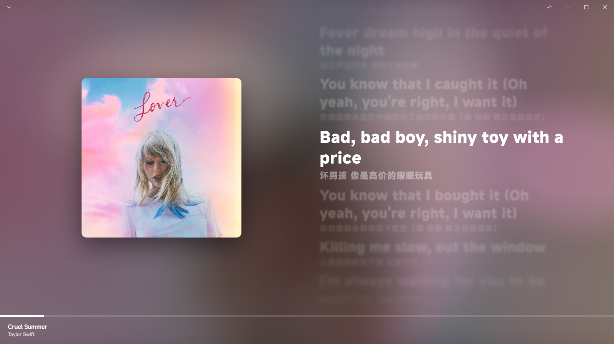

# MelodyBox — AI 驱动的沉浸式桌面音乐播放系统

基于 **Electron + Vue3 + Flask** 三层进程架构的桌面音乐播放器，集成 **双模态 AI 推荐引擎**（文本 Embedding + 音频 Embedding），支持 7 种智能推荐模式与天气感知场景化推荐。自研 FFmpeg 实时 PCM 转码引擎与 Web Audio 音频律动可视化，在 < 500MB 运存下实现 144FPS 全动态视觉效果。

> 演示视频：[bilibili](https://b23.tv/y0j0fFq)



---

## 性能实测

| 指标 | 数据 |
|------|------|
| 运行时内存 | **< 500MB**（含 0.5GB FLAC 播放） |
| 全动效帧率 | **144FPS**（插电满负荷） |
| 拔电降频帧率 | **40FPS** 持久流畅 |
| 全动效 CPU+GPU | **≤ 20%**（插电 192kHz/24bit Hi-Res） |
| 关闭动效 CPU+GPU | **约 2%** |
| 音乐库滚动 | **1000+ 首歌曲零卡顿**，虚拟滚动 |

---

## 技术栈

| 层级 | 技术 |
|------|------|
| 桌面容器 | Electron 28 |
| 前端 | Vue 3 (Composition API) + Pinia + Vue Router |
| UI | Element Plus + 自定义 CSS 动画系统 |
| 后端 | Python Flask（PyInstaller 打包为独立 exe） |
| 数据库 | SQLite 3（WAL 模式，18 张表 + all_songs VIEW + 增量扫描 + MD5 指纹重连） |
| **AI 文本 Embedding** | **fastembed + multilingual-e5-large（ONNX Runtime，1024 维，100+ 语言）** |
| **AI 音频 Embedding** | **MERT-v1-330M（PyTorch + ONNX，768 维，GPU/CPU 自适应）** |
| **AI 推荐引擎** | **余弦相似度 + 流派/语种加权融合 + MMR 多样性重排** |
| **LLM 集成** | **OpenAI 兼容 SDK（DeepSeek / 智谱 GLM）+ SSE 流式响应** |
| 音频引擎 | FFmpeg 子进程 stdout pipe 实时 PCM 转码 |
| 律动可视化 | Web Audio API AnalyserNode（fftSize=128，64 频段） |
| 动画 | 自研 CSS 硬件加速 + GSAP + Web Animation API |
| 构建 | Vite + electron-builder（NSIS 安装包） |

---

## 项目结构

```
melodybox/
├── electron/                          # Electron 主进程
│   ├── main.js                        # 主进程（窗口管理、thumb:// 协议、HTTP 音频服务器）
│   └── preload.js                     # 预加载脚本（IPC 桥接）
├── src/                               # Vue 前端
│   ├── main.js                        # Vue 入口
│   ├── App.vue                        # 根组件
│   ├── router/index.js                # 17 个路由页面
│   ├── stores/                        # Pinia 状态管理
│   │   ├── player.js                  # 播放器引擎（4 种播放模式、Fisher-Yates 洗牌、Seek）
│   │   ├── library.js                 # 音乐库（虚拟滚动、搜索/排序/筛选）
│   │   ├── playlist.js                # 歌单管理
│   │   ├── settings.js                # 用户设置
│   │   ├── auth.js                    # 会员体系（free/vip/svip + admin）
│   │   ├── ai.js                      # AI 推荐（7 种模式、Embedding 状态、30 分钟缓存）
│   │   ├── weather.js                 # 天气感知（和风天气 API、情绪映射、30 分钟缓存）
│   │   └── progress.js                # 缩略图生成进度
│   ├── components/
│   │   ├── layout/                    # TitleBar（无边框窗口控制）、Sidebar
│   │   ├── player/                    # PlayerBar、NowPlayingPanel（全屏歌词+律动）
│   │   │                              # DesktopLyrics（桌面独立透明窗口）、QueuePanel
│   │   ├── music/                     # MusicCard、ContextMenu（右键菜单）
│   │   ├── LazyCover.vue              # 封面懒加载（IntersectionObserver）
│   │   └── ProgressPanel.vue          # 缩略图生成进度
│   ├── views/                         # 17 个页面视图
│   │   ├── HomeView.vue               # 首页（统计概览 + 最近播放 + 天气卡片）
│   │   ├── LibraryView.vue            # 音乐库（虚拟滚动列表）
│   │   ├── AlbumView.vue / AlbumsView.vue
│   │   ├── ArtistView.vue / ArtistsView.vue
│   │   ├── PlaylistView.vue           # 歌单详情
│   │   ├── RecommendPlaylistView.vue  # AI 推荐歌单（综合/语言/情绪/相似/冷门宝藏/天气）
│   │   ├── FoldersView.vue            # 文件夹管理
│   │   ├── HistoryView.vue            # 播放历史
│   │   ├── TopPlaysView.vue           # 播放次数排行
│   │   ├── TrackInfoView.vue          # 音轨元数据详情
│   │   ├── SettingsView.vue           # 设置页（含 AI Embedding 生成管理）
│   │   ├── AdminView.vue              # 管理员面板（云端曲库管理）
│   │   ├── LoginView.vue / UserView.vue
│   │   ├── DesktopLyricsView.vue      # 桌面歌词独立窗口
│   │   └── RhythmDebugView.vue        # 律动调试窗口
│   ├── composables/                   # useScrollMemory、useTrackList、useModal
│   ├── directives/                    # v-ripple 波纹指令
│   └── utils/
│       ├── coverColorExtractor.js     # 加权 K-Means 封面主色提取
│       ├── format.js                  # 4 种 LRC 解析 + 双语合并 + 逐字歌词
│       ├── mediaSession.js            # 系统 Media Session 集成
│       ├── scanNotify.js              # 扫描进度提示
│       └── toast.js                   # 轻量 Toast 通知
├── backend/                           # Flask API
│   ├── app.py                         # Flask 入口（自动建 18 张表 + all_songs VIEW）
│   ├── config/config.py               # 配置（数据库路径、AI 模型设置）
│   ├── models/__init__.py
│   ├── routes/
│   │   ├── ai.py                      # AI 推荐 API（7 种模式、Embedding 生成/状态查询）
│   │   ├── auth.py                    # 用户认证
│   │   ├── cloud.py                   # 云端曲库管理（管理员 CRUD）
│   │   ├── folders.py                 # 文件夹管理
│   │   ├── playlist.py                # 歌单 CRUD
│   │   ├── settings.py               # 用户设置 API
│   │   ├── stats.py                   # 播放统计 + 指纹重连
│   │   └── weather.py                 # 天气 API（和风天气 + LLM 情绪语义映射）
│   ├── services/
│   │   ├── embedding.py               # AI Embedding 服务（E5 文本 + MERT 音频，GPU/CPU 自适应）
│   │   ├── recommender.py             # AI 推荐引擎（余弦相似度 + 加权融合 + MMR 重排）
│   │   └── scanner.py                 # mutagen 元数据解析 + 增量扫描 + 缩略图生成
│   ├── utils/
│   │   └── cache.py                   # LRU 缓存工具
│   └── tools/
│       ├── fix_instrumental_lang.py   # 纯音乐语言标记修复
│       └── refresh_instrumental_embeddings.py
├── database/schema.sql                # MySQL 参考建表脚本
├── bin/                               # 内嵌 ffmpeg.exe
├── start-dev.bat                      # 一键开发启动
├── build-flask.bat                    # Flask → PyInstaller 打包
└── vite.config.js
```

---

## 核心特性

### 1. 音频引擎 — FFmpeg 实时 PCM 转码

Chromium 的 FFmpeg FLAC demuxer 对某些 FLAC 文件无法计算 PTS，导致播放失败。本项目的解决方案：

- **手写 FLAC STREAMINFO 二进制解析器**：字节级解析采样率、声道、位深、总采样数、block size
- **FFmpeg stdout pipe 实时转码**：`FLAC → WAV` 走 pipe:1 直传 HTTP Response，零磁盘临时文件
- **自动位深适配**：16bit → pcm_s16le、24bit → pcm_s24le、32bit → pcm_s32le，FLAC 全链路无损
- **精确 Content-Length**：从 STREAMINFO 元数据推导 WAV 文件大小，无需等待 FFmpeg 完成
- **智能双模式 Seek**：远距离（>5s）URL reload + `start=` 参数让 FFmpeg 从目标时间重解码；近距离直接 `audio.currentTime` + seekOffset 时间轴映射
- **客户端断连安全**：req/res close 事件立即 kill FFmpeg 子进程（taskkill），防止 write-after-end
- **兼容格式**：MP3 / FLAC / WAV / OGG / AAC / M4A / WMA / APE（8 种）

### 2. CSS 硬件加速歌词动画引擎

**全屏歌词页**：

- **逐字卡拉OK（全屏）**：`::before` 伪元素 + `clip-path` 宽度裁剪 + 渐变遮罩软边，每个字独立 CSS 过渡
- **逐字抬升动画**：已唱字 `translateY(-3px)`，可配置 FPS
- **多米诺行级联滚动**：行级联偏移动画，stagger 38ms × 最大 18 行，`cubic-bezier(0.2, 0.9, 0.3, 1.0)` 曲线
- **Apple Music 风格距离模糊**：远离当前行的歌词 `filter: blur()`，用户滚轮进入手动模式，5 秒自动回位
- **方向感知切歌过渡**：next/prev 切换不同的歌词淡入淡出方向
- **远距离跳转缓冲**：`jumpPending` 延迟一帧让新旧行同步过渡，避免视觉脱节

**桌面歌词独立透明窗口**：

- Electron BrowserWindow（`frame: false, transparent: true, alwaysOnTop: true, skipTaskbar: true`）
- 窗口高度精确计算（字号 × 翻译比例 × 可视行数 → IPC 动态调整尺寸）
- **逐字卡拉OK（桌面）**：`::after` 伪元素 + `mask-image` 渐变遮罩 + `--kara-fill` CSS 变量驱动，帧跳过策略（每 2 帧更新，CPU 减半）
- **跑马灯**：长文本左右滚动，Web Animation API 驱动，根据下一句时间戳计算滚动时长
- **连续透明度 + 缩放**：基于与活跃行距离的连续计算，非离散
- **渲染进程崩溃恢复**：`render-process-gone` 监听 + `lyricsLoaded` 标记防止反馈循环
- **首帧数据多重试推送**：200/500/1000/2000ms 四次重试，确保新窗口收到数据

**LRC 格式兼容**：标准逐句 LRC、多时间戳聚合、Enhanced 逐字 LRC、纯文本 fallback（每行估算 4 秒）+ 双语自动合并 + Unicode 转义解码 + BOM 头清洗

### 3. Web Audio 音频律动可视化

**封面主色提取**：

- 加权 K-Means 色彩聚类（k=5），亮度排序初始化质心
- 空间环形权重（中心 0.3、环形 1.0、边缘 0.6），避免封面文字/Logo 干扰
- 合并输出 shadow / mid / highlight 三色
- 饱和度优先高光选取

**光球生成**：

- 3 色 → 6 张径向渐变 PNG Data URL（Canvas 渲染）
- 5 段渐变（100%→95%→60%→15%→0%），边缘同色零透避免 soft-light 黑边
- 6 个独立 `@keyframes`，不同周期（13s-21s），不同相位偏移
- CSS 混合模式：`mix-blend-mode: soft-light`

**音频律动分析**：

- Web Audio API AnalyserNode（fftSize=128，64 频段，smoothingTimeConstant=0.6）
- 三频段分析：LOW（bins 1-4，鼓点 punch）、MID（bins 6-30，乐器/人声）、FULL（全频段）
- 自适应基线 delta 算法：0.5% 衰减基线 + 暖启动（首帧快照）+ Lerp 平滑（0.12），鼓点瞬态脉冲检测
- 能量累积器：密集鼓点持续走高，安静段 6%/帧衰减，半衰期约 0.18s
- CSS 变量驱动：`--flow-scale`（LOW 脉冲 + 累积能量 + MID 增量）、`--flow-opacity-mid`、`--flow-opacity-hl`
- 独立律动调试窗口（RhythmDebugView）：实时频谱数据可视化

### 4. 封面飞行动画

- 手写 cubic-bezier 缓动求解器（二分查找，12 次迭代）
- 独立 DOM 分身飞行（高分渲染 + 反向缩放避免模糊）
- 方向感知切歌动画：下一曲 → 封面从 bottom 中心缩小，上一曲 → 从 top 中心缩小
- 封面预加载 + LRU 缓存（前后各 5 首，最多 11 张），连续切歌零延迟

### 5. AI 智能推荐引擎

**双模态 Embedding 流水线**：

- **文本向量**：`intfloat/multilingual-e5-large`（1024 维，ONNX Runtime 推理，100+ 语言），从歌曲标题、艺术家、专辑、流派、歌词拼接文本提取语义特征
- **音频向量**：`MERT-v1-330M` 音乐理解模型（768 维），直接从音频波形提取音乐特征（节奏、音色、情绪）
- **GPU/CPU 智能调度**：MERT 优先使用 GPU 加速，E5 初始分配 CPU，MERT 完成后自动让渡 GPU 给 E5，实现双模型并行不停歇
- **模型自动下载 + 进度追踪**：首次使用自动从 HuggingFace 下载（支持镜像加速 `hf-mirror.com`），前端实时显示下载/编码进度
- **断点续传**：中断后重跑自动跳过已有向量的歌曲，从断点继续编码

**7 种推荐模式**：

| 模式 | 算法 | 适用场景 |
|------|------|----------|
| 综合推荐 | `0.40×Embedding + 0.30×音频 + 0.15×流派 + 0.15×语种` 加权融合 | 日常发现新歌 |
| 语言聚类 | 语种匹配 + Embedding 相似度 | 想听特定语言的歌 |
| 情绪搜索 | 7 种情绪语义匹配（悲伤/激昂/舒缓/动感/清新/浪漫/励志） | 按心情听歌 |
| 单曲相似 | 余弦距离排序 | 喜欢某首歌想找类似的 |
| 冷门宝藏 | 播放量低 + Embedding 高相似度 | 发现被埋没的好歌 |
| 天气驱动 | 天气 → LLM 情绪映射 → 情绪向量检索 | 跟着天气听歌 |
| 智能随机 | Embedding 聚类中心 + 随机采样 | 不重复的随机播放 |

**推荐算法细节**：

- **加权余弦相似度**：文本向量（语义理解）+ 音频向量（音乐特征）+ 流派/语种偏好，四维加权计算综合得分
- **MMR 多样性重排**：`λ×相关性 - (1-λ)×与已选集合最大相似度`，避免推荐结果过于同质化
- **冷门宝藏策略**：反直觉推荐——播放次数越低权重越高，同时保证 Embedding 相似度不低于阈值，发现被埋没的好歌
- **双维情绪分析**：
  - 文本维度：歌词语义 → 7 种情绪得分（悲伤、激昂、舒缓、动感、清新、浪漫、励志）
  - 音频维度：MERT 音频特征 → 独立情绪评分
  - 双维加权合并，预计算存入 `song_mood_scores` 表
- **前端缓存**：推荐结果 30 分钟 localStorage 缓存，避免重复请求

**天气感知场景化推荐**：

- 和风天气 API 获取实时天气数据（温度、天气现象、风力、湿度）
- **LLM 语义映射**：DeepSeek / 智谱 GLM 分析天气特征，生成听歌建议与情绪标签（如"阴雨绵绵 → 舒缓/治愈"）
- SSE 流式传输，前端实时展示 AI 分析过程
- 天气情绪 → 情绪向量检索 → 场景化推荐歌单
- 首页天气卡片：温度 + 天气图标 + AI 推荐语 + 一键跳转推荐歌单

### 6. 云端曲库与多用户体系

- **云端曲库管理**：管理员可上传/管理云端歌曲，本地曲库与云端曲库通过 `all_songs VIEW` 统一查询
- **云端歌曲状态**：online / offline 上下架管理，仅上架歌曲对普通用户可见
- **多用户体系**：free / vip / svip 三级会员 + admin 管理员
- **MD5 指纹重连**：文件删除后重新扫描，播放统计通过 `md5(title|artist|album)` 自动关联

### 7. 产品完整度

- 17 个路由页面（首页、音乐库、专辑、艺术家、歌单、AI 推荐歌单、文件夹管理、播放历史、播放排行、音轨信息、设置、管理员面板、登录、用户中心、桌面歌词、律动调试）
- 18 张 SQLite 表 + `all_songs VIEW`（WAL 模式），含索引、外键约束
- 增量扫描（基于文件路径 + mtime 比对，已扫描文件秒跳过）
- 缩略图预生成（线程池并行，6 种尺寸 72-332px，WebP/JPEG）
- 拇指协议 `thumb://`：绕过 Flask HTTP 层，Chromium 直读本地缩略图，immutable 一年缓存
- 30 秒有效播放统计（对齐 Spotify 标准），短曲播完也计入
- 媒体会话集成（系统 Media Session API）

---

## 播放器引擎

- 4 种播放模式：顺序、单曲循环、随机（Fisher-Yates 洗牌，退出恢复原队列）、列表循环
- 音频错误自愈：`MEDIA_ERR_DECODE` 等错误自动切下一首
- Hi-Res 音质自动判定：24bit/96kHz+ → Hi-Res，16bit+ / 44.1kHz+ → CD+，有损 → HQ

---

## 架构设计

```
┌─────────────────────────────────────────────┐
│              Electron 主进程                 │
│  ┌──────────────────┐ ┌──────────────────┐  │
│  │  Flask 子进程      │ │  HTTP 音频服务器   │  │
│  │  (PyInstaller exe)│ │  (127.0.0.1:51234)│  │
│  │  - REST API       │ │  - FFmpeg pipe     │  │
│  │  - SQLite WAL     │ │  - thumb:// 协议    │  │
│  │  - AI 推荐引擎     │ │                    │  │
│  │  - Embedding 服务  │ │                    │  │
│  │  - LLM 对话       │ │                    │  │
│  └──────────────────┘ └──────────────────┘  │
│  ┌──────────────────────────────────────┐   │
│  │  窗口管理: 主窗口|桌面歌词|律动调试       │   │
│  └──────────────────────────────────────┘   │
└─────────────────────────────────────────────┘
        │ IPC 通信
┌───────▼─────────────────────────────────────┐
│              Vue 3 渲染进程                   │
│  ┌────────────────┐  ┌──────────────────┐   │
│  │ Pinia 状态管理  │  │ CSS 歌词动画引擎  │   │
│  │ (player/ai/     │  │ (硬件加速合成层)  │   │
│  │  weather stores)│  │                  │   │
│  └────────────────┘  └──────────────────┘   │
│  ┌──────────────────────────────────────┐   │
│  │ Web Audio API | Canvas | rAF 动画循环 │   │
│  └──────────────────────────────────────┘   │
└─────────────────────────────────────────────┘
```

---

## 快速开始

### 环境要求

- Node.js 20+ LTS
- Python 3.10+（虚拟环境 `D:\flask_env`）
- FFmpeg（项目中 `bin/` 目录已内嵌）

### 安装

```bash
cd "d:\Codeing\Language\Graduation project\Code"
npm install
```

### 开发模式

双击 `start-dev.bat`，自动启动 Flask API → Vite → Electron。

或分别启动：

```bash
# 终端 1 — Flask
npm run flask

# 终端 2 — Electron（等待 Vite 就绪后启动）
npm run electron:dev
```

### 打包

```bash
# 完整打包（Flask exe + Vite dist + electron-builder）
npm run electron:build

# 快速打包（跳过 Flask，使用已有 flask-dist）
npm run electron:build:quick
```

生成 `release/MelodyBox Setup.exe`，用户安装即用，无需 Python/Node/MySQL。

---

## 支持格式

| 格式 | 扩展名 | 音频引擎 | 元数据 |
|------|--------|---------|--------|
| MP3 | .mp3 | 原生 | ID3v1/v2 |
| FLAC | .flac | FFmpeg 转码 PCM | Vorbis Comment |
| WAV | .wav | 原生 | RIFF INFO |
| OGG | .ogg | 原生 | Vorbis Comment |
| AAC/M4A | .aac .m4a | 原生 | MP4 |
| WMA | .wma | 原生 | ASF |
| APE | .ape | 原生 | APEv2 |

---

## 使用说明

1. 启动后点击首页「导入本地音乐」，选择含音乐文件的文件夹，自动递归扫描子目录
2. 扫描完成，音乐库页浏览 / 搜索 / 排序，双击歌曲播放
3. 右下角全屏歌词按钮打开歌词页（律动光球背景 + 逐字卡拉OK）
4. 播放栏点击桌面歌词图标开启独立透明桌面歌词窗口
5. 音乐库右键菜单添加到歌单
6. 再次启动自动加载数据库，无需重新扫描
7. 点击刷新按钮增量更新（仅处理新增/修改/删除的文件）
8. 设置页可开关动效 / 调整歌词字号 / 字体粗细 / 模糊强度等
9. **AI 推荐**：设置页点击「生成 Embedding」，完成后侧边栏出现 7 种推荐模式入口
10. **天气推荐**：配置和风天气 API Key 后，首页天气卡片自动展示 AI 听歌建议

---

## License

MIT
